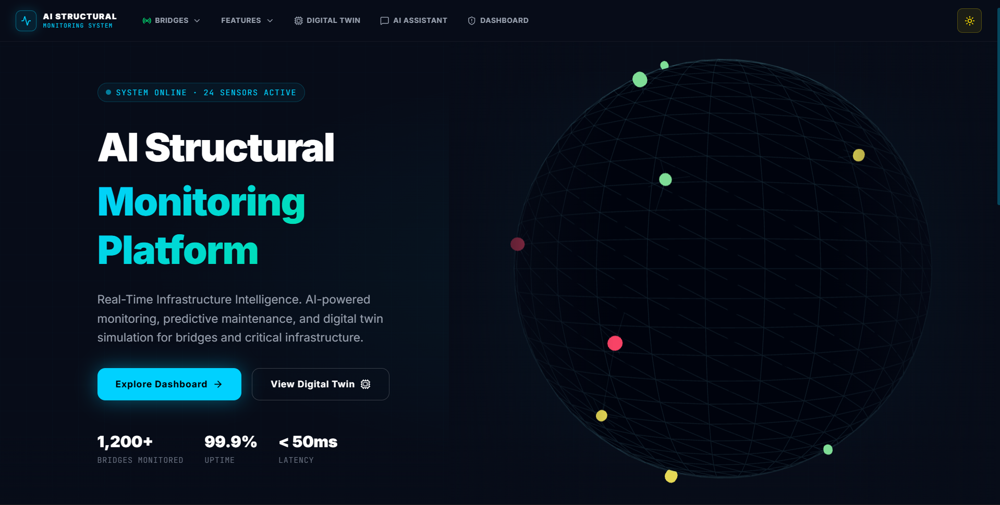
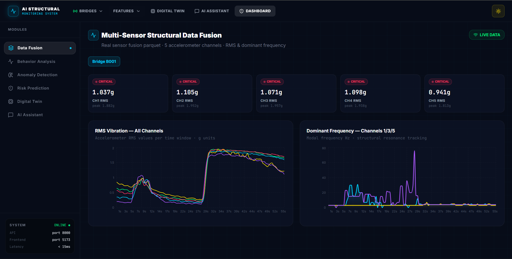
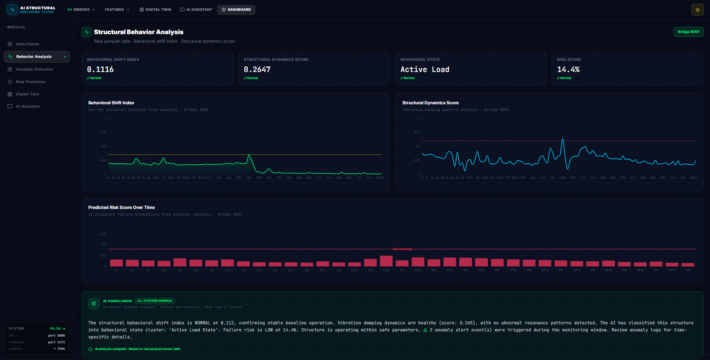
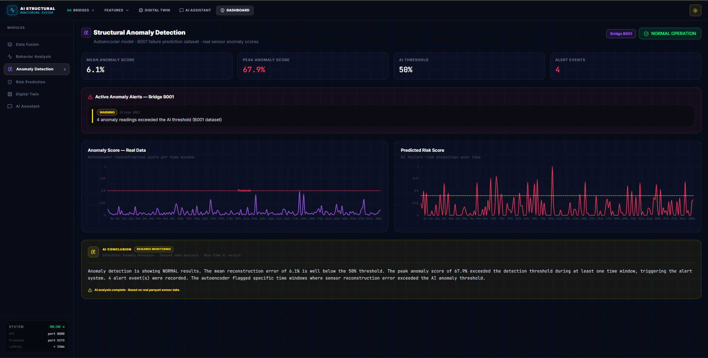
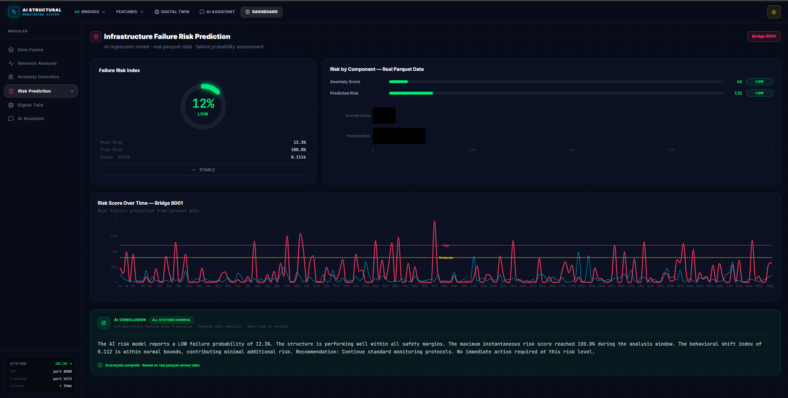
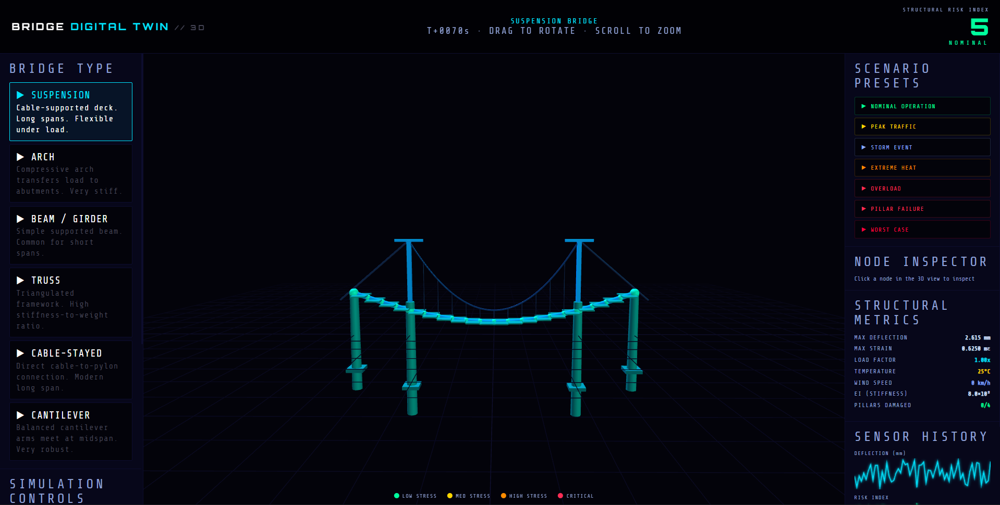
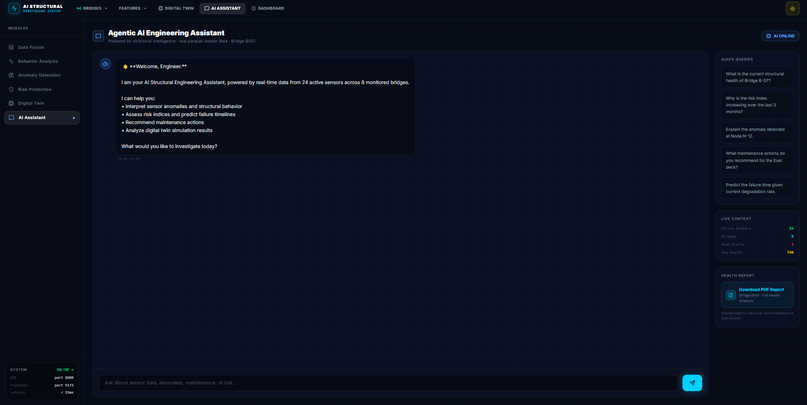

# AI Structural Monitoring Platform

## Overview
Structural Monitoring Platform is a React based bridge monitoring tool that uses multi-sensor data to monitor the structural health of bridges in real time.

## Demo
 













## Features

### Data Fusion
- Provides Real-Time Data for multiple vibration sensors from different locations on the bridge
- Displays a graph that tracks RMS Vibration against time 
- Displays a second graph that tracks Bridge's Dominant Frequency against time

### Behavior Analysis
- Generates a Behavioral Shift Index using sensor data
- Classifies based on the Shift Index between Low Load, Active Load and High Load
- Tracks Behavioral Shift Index over time

### Anomaly Detection
- Generates a Mean Anomaly Score using sensor data and Behavior Analysis output
- Tracks the number of times the Anomaly score crossed the threshold value

### Risk Prediction
- Displays Failure Risk Index based on the sensor data and output of Behavior Analysis and Anomaly Scores as well as traffic load and temperature values
- Tracks the Risk score over time and generates a safe threshold value 

### Digital Twin
- An interactable 3D model displaying the current strain on the all the different nodes on the bridge
- The user has the option to use the simulation controls using a slider for traffic load, temperature and wind speed. The stress index on the model is color coded accordingly
- Predefined presets for different stress conditions
- Displays and updates the structural metrics dynamically as the strain changes

### AI Overview
- Gives a summary for all the displayed metrics on each tab
- Labels the bridge as Safe or Unsafe

### AI Assistant
- A user friendly AI assistant that provides useful insights on other tabs as well as helps the user understand any sensor metric in detailed but simple terms
- Example queries provided to help the user get started with the chatbot: 
    - What is the current structural health of Bridge B001?
    - Why is the risk index increasing over the last 3 monts?
    - Explain the anomaly detected at Node N-12.
    - What maintenance actions do you recomment for the East side of the bridge?
    - Predict the failure time given current degradation rate.

## Tech Stack

- Frontend: React 19
- 3D Visualization: Three.js
- Data Visualization: Recharts
- Styling: Tailwind CSS v4
- Backend: Python
- API Framework: FastAPI
- Libraries: Numpy, Pandas, LangChain, Scikit-learn, Scipy, FAISS 
AI Model: Ollama (llama3) 

## Installation 

### 1. Prerequisites
Ensure the following are installed on your system:
- **Node.js** (v18 or higher)
- **Python** (v3.9 or higher)
- **Git**
- **Ollama** (for running local AI models)

### 2. Clone the Repository
- 
   ```bash
   git clone <repository-url>
   cd project_structural
   ```

### 3. Backend Setup (Intelligence & API)

- **Navigate to the Backend Directory:**
   ```bash
   cd structure_intelligence
   ```

- **Create and Activate a Virtual Environment:**
   ```bash
   python -m venv .venv
   # Windows:
   .venv\Scripts\activate
   # macOS/Linux:
   source .venv/bin/activate
   ```

- **Install Dependencies:**
   ```bash
   pip install -r requirements.txt
   pip install -r api_requirements.txt
   pip install -r agent_requirements.txt
   pip install reportlab  # For PDF report generation
   ```

- **AI Model Setup (Ollama):**
   - Ensure Ollama is running.
   - Pull the required models:
    ```bash
    ollama pull llama3
    ollama pull nomic-embed-text
    ```

- **Initialize Vector Store:**
   ```bash
   python embeddings/build_vectorstore.py
   ```

- **Run the API:**
   ```bash
   uvicorn api:app --reload
   ```
   The API will be available at `http://localhost:8000`.

### 4. Frontend Setup (Modern Dashboard)

- **Open a New Terminal and Navigate to Frontend:**
   ```bash
   cd project_structural/frontend
   ```

- **Install NPM Packages:**
   ```bash
   npm install
   ```

- **Run the Development Server:**
   ```bash
   npm run dev
   ```
   The application UI will be available at the URL shown in your terminal (usually `http://localhost:5173`).

## License

This project is licensed under the MIT License.